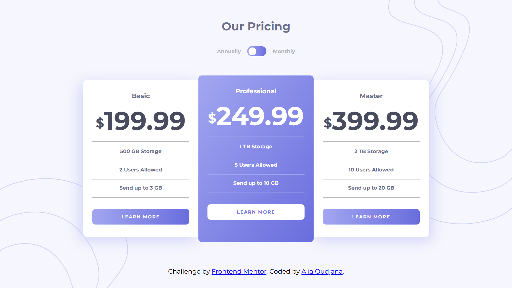

# Frontend Mentor - Pricing component with toggle solution

This is a solution to the [Pricing component with toggle challenge on Frontend Mentor](https://www.frontendmentor.io/challenges/pricing-component-with-toggle-8vPwRMIC).

## Table of contents

- [Overview](#overview)
  - [The challenge](#the-challenge)
  - [Screenshot](#screenshot)
  - [Links](#links)
  - [Built with](#built-with)
- [Author](#author)

## Overview

### The challenge

Users should be able to:

- View the optimal layout for the component depending on their device's screen size
- Control the toggle with both their mouse/trackpad and their keyboard

### Screenshot

### Links

- Solution URL: https://github.com/AliaOudjana/Pricing-component-with-toggle
- Live Site URL: https://aliaoudjana.github.io/Pricing-component-with-toggle/

### Built with

- HTML5
- CSS custom properties
- Flexbox
- JavaScript
- Mobile-first workflow

## Author

- Frontend Mentor - [@AliaOudjana](https://www.frontendmentor.io/profile/AliaOudjana)
- LinkedIn - [@Alia-Oudjana](https://www.linkedin.com/in/alia-oudjana/)
